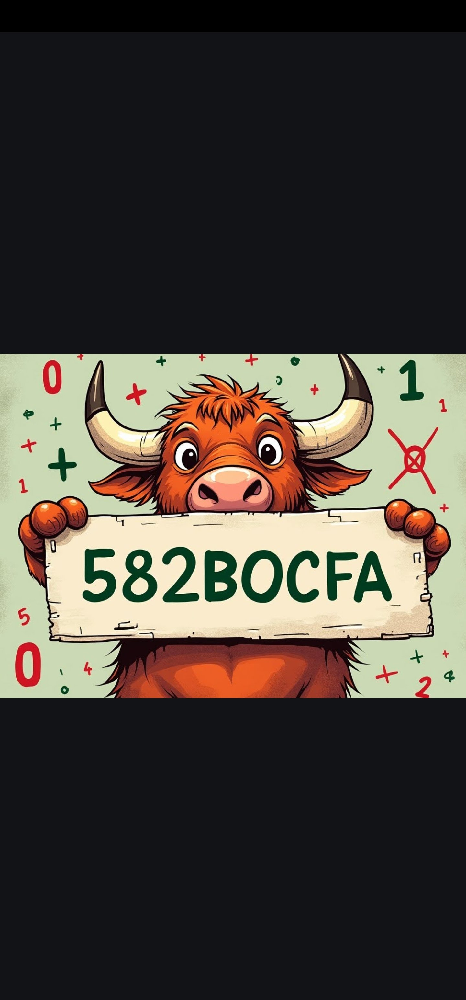

# CryptoAudiKing Key Game

## Images

Below are the images from the `/images/` directory that hold the clues for the wallet Private Key:

 





---

## Description

This script generates random Ethereum private keys, derives wallet addresses, and checks their balances using the Infura Ethereum API. If it finds a wallet with a non-zero balance, the private key, wallet address, and balance are saved to a file.

## Features
- Continuously generates random Ethereum wallets until one with a balance is found.
- Logs wallet information to `wallets_with_balance.txt`.
- Uses Infura for reliable Ethereum network interaction.

---

## Prerequisites
1. **Node.js**: Ensure you have Node.js installed. [Download Node.js](https://nodejs.org/)
2. **Infura Account**: Create an Infura account and get a project ID for Ethereum API access.

---

## Getting Started

### 1. Clone the Repository
Clone this repository to your local machine:
```bash
git clone https://github.com/MotoAcidic/CryptoAudiKing-KeyGame.git
cd CryptoAudiKing-KeyGame
```

### 2. Install Dependencies
Install the required dependencies:
```bash
npm install
```

### 3. Set Up .env File
Create a .env file in the root directory and add the following:
```bash
INFURA_PROJECT_ID=your-infura-project-id
ETH_CHARACTERS=0,1,2,3,4,5,6,7,8,9,a,b,c,d,e,f,a,b,c,d,e,f,a,b,c,d,e,f,a,b,c,d,e,f,a,b,c,d,e,f
```

- INFURA_PROJECT_ID: Replace with your Infura project ID (see instructions below on how to get it).

- ETH_CHARACTERS: A comma-separated string containing hexadecimal characters for private key generation. Ensure this includes exactly 64 characters.
  
### 4. Run the Script
Start the script to begin testing wallets:
```bash
node index.mjs
```

## Infura Setup Guide

1. **Create an Infura Account**  
   - Visit the [Infura website](https://infura.io/).  
   - Click **Sign Up** to create an account, or **Log In** if you already have one.

2. **Create a New Project**  
   - Once logged in, go to the **Dashboard**.  
   - Click **Create New Key** or **Create New Project**.  
   - Select **Ethereum** as the network.  
   - Enter a project name (e.g., "Wallet Checker") and save.

3. **Get Your Project ID**  
   - Open the newly created project.  
   - Copy the **Project ID** from the project settings.

4. **Add Your Project ID to `.env`**  
   - Paste the project ID into the `INFURA_PROJECT_ID` field in your `.env` file.

---

## Output

The script will log information about tested wallets. If a wallet with a balance is found, it will be written to `wallets_with_balance.txt` in the following format:
```bash
Private Key: 0xabc123..., Address: 0x456def..., Balance: 1.23 ETH
```

## Stopping the Script

The script runs indefinitely until it finds a wallet with a balance. To stop it manually, press `Ctrl+C` in the terminal.

---

## Notes

- **Resource Usage**: This script can be resource-intensive. Monitor system and API limits during execution.
- **Rate Limits**: Infura has rate limits for API calls. Consider upgrading to a paid plan for higher limits if needed.

---

## Disclaimer

This script is for educational purposes only. Misuse of this script may violate local or international laws. Use it responsibly. The authors are not responsible for any misuse or damages caused by this script.